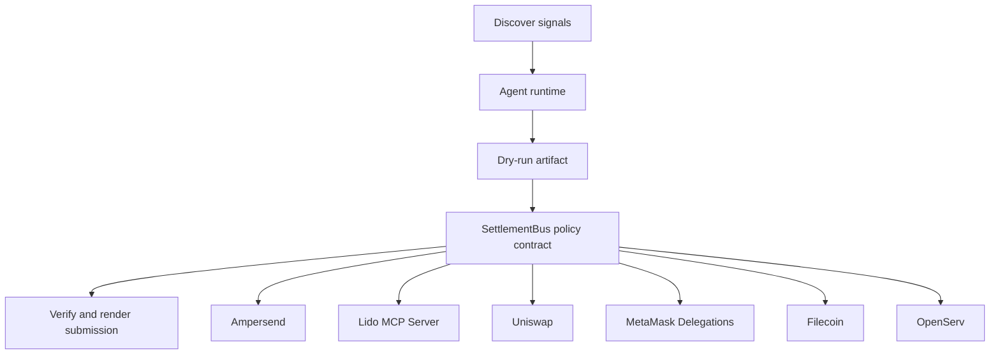

# Ampersend Settlement Bus

- **Repo:** [Synthesis-Ampersend](https://github.com/CrystallineButterfly/Synthesis-Ampersend)
- **Primary track:** Ampersend
- **Category:** transport
- **Primary contract:** `SettlementBus`
- **Primary module:** `ampersend_bus`
- **Submission status:** implementation ready, waiting for credentials and TxIDs.

## What this repo does

A settlement bus that packages intent metadata together with payments and routing instructions so downstream tracks can share one transport layer.

## Why this build matters

A transport layer packages intent metadata together with settlement instructions so downstream tracks can reuse one message bus. The contract emits intent receipts and settlement checkpoints, while Python adapters stage routing plans for live payment infrastructure.

## Submission fit

- **Primary track:** Ampersend
- **Overlap targets:** Lido MCP Server, Uniswap Agentic Finance, MetaMask Delegations, Filecoin, OpenServ, ERC-8004 Receipts
- **Partners covered:** Ampersend, Lido MCP Server, Uniswap, MetaMask Delegations, Filecoin, OpenServ, ERC-8004 Receipts

## Idea shortlist

1. Payment + Intent Routing Bus
2. Lido MCP Settlement Spine
3. Delegated Execution Transport

## System graph



## Repository contents

| Path | What it contains |
| --- | --- |
| `src/` | Shared policy contracts plus the repo-specific wrapper contract. |
| `script/Deploy.s.sol` | Foundry deployment entrypoint for the policy contract. |
| `agents/` | Python runtime, project spec, env handling, and partner adapters. |
| `scripts/` | Terminal entrypoints for run, demo planning, and submission rendering. |
| `docs/` | Architecture, credentials, security notes, and demo steps. |
| `submissions/` | Generated `synthesis.md` snippet for this repo. |
| `test/` | Foundry tests for the Solidity control layer. |
| `tests/` | Python tests for runtime and project context. |
| `agent.json` | Submission-facing agent manifest. |
| `agent_log.json` | Local execution log and status trail. |

## Autonomy loop

1. Discover signals relevant to the repo track and its overlap targets.
2. Build a bounded plan with per-action and compute caps.
3. Persist a dry-run artifact before any live execution.
4. Enforce onchain policy through the guarded contract wrapper.
5. Verify outputs, update receipts, and render submission material.

## Security controls

- Admin-managed allowlists for targets and selectors.
- Per-action caps, daily caps, cooldown windows, and a principal floor.
- Reporter-only receipt anchoring and proof attachment.
- Env-only secrets; no committed private keys or partner tokens.
- Pause switch plus dry-run-first execution flow.

## Action catalog

| Action | Partner | Purpose | Max USD | Sensitivity |
| --- | --- | --- | --- | --- |
| `ampersend_settlement_bundle` | Ampersend | Use Ampersend for a bounded action in this repo. | $25 | medium |
| `lido_mcp_server_mcp_call` | Lido MCP Server | Use Lido MCP Server for a bounded action in this repo. | $2 | medium |
| `uniswap_quote_route` | Uniswap | Use Uniswap for a bounded action in this repo. | $220 | medium |
| `metamask_delegations_delegate_scope` | MetaMask Delegations | Use MetaMask Delegations for a bounded action in this repo. | $2 | high |
| `filecoin_proof_store` | Filecoin | Use Filecoin for a bounded action in this repo. | $20 | medium |
| `openserv_job_dispatch` | OpenServ | Use OpenServ for a bounded action in this repo. | $10 | medium |
| `erc_8004_receipts_receipt_anchor` | ERC-8004 Receipts | Use ERC-8004 Receipts for a bounded action in this repo. | $1 | medium |

## Local terminal flow (Anvil + Sepolia)

```bash
export SEPOLIA_RPC_URL=https://sepolia.infura.io/v3/YOUR_KEY
anvil --fork-url "$SEPOLIA_RPC_URL" --chain-id 11155111
cp .env.example .env
# keep private keys only in .env; TODO.md stays local-only too
forge script script/Deploy.s.sol --rpc-url "$RPC_URL" --broadcast
python3 scripts/run_agent.py
python3 scripts/render_submission.py
```

## Commands

```bash
python3 -m unittest discover -s tests
forge test
python3 scripts/run_agent.py
python3 scripts/plan_live_demo.py
python3 scripts/render_submission.py
```

## Credentials

| Partner | Variables | Docs |
| --- | --- | --- |
| Ampersend | AMPERSEND_API_KEY, AMPERSEND_PAYMENT_URL | https://docs.ampersend.ai/ |
| Lido MCP Server | RPC_URL | https://docs.lido.fi/ |
| Uniswap | UNISWAP_API_KEY, UNISWAP_QUOTE_URL | https://developers.uniswap.org/ |
| MetaMask Delegations | RPC_URL | https://docs.metamask.io/delegation-toolkit/ |
| Filecoin | FILECOIN_API_TOKEN, FILECOIN_UPLOAD_URL | https://docs.filecoin.cloud/ |
| OpenServ | OPENSERV_API_KEY, OPENSERV_AGENT_URL | https://docs.openserv.ai/ |
| ERC-8004 Receipts | RPC_URL | https://eips.ethereum.org/EIPS/eip-8004 |

## Live demo plan

1. Copy .env.example to .env and fill the required keys.
2. Deploy the contract with forge script script/Deploy.s.sol --broadcast for SettlementBus.
3. Run python3 scripts/run_agent.py to produce a dry run for ampersend_bus.
4. Set LIVE_MODE=true and rerun python3 scripts/run_agent.py with real credentials.
5. Run python3 scripts/render_submission.py and attach TxIDs plus repo links.
